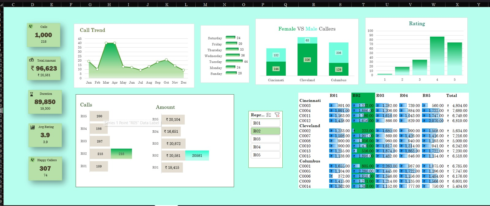

#  Call Center Performance Dashboard

##  Overview

The **Call Center Performance Dashboard** is an interactive Microsoft Excel dashboard developed to analyze call center operations and monitor key business performance indicators. The dashboard transforms raw customer call data into meaningful insights using Pivot Tables, Pivot Charts, Slicers, Conditional Formatting, and Excel formulas.

This project enables managers and analysts to monitor call trends, customer satisfaction, employee performance, and revenue generation through a user-friendly visual interface.

---

##  Objectives

- Analyze overall call center performance.
- Monitor monthly call trends.
- Evaluate customer satisfaction ratings.
- Compare male and female callers.
- Track representative-wise performance.
- Analyze city-wise customer distribution.
- Measure total revenue generated.
- Support data-driven business decisions.

---

##  Features

- Monthly Call Trend Analysis
   Total Calls KPI
-  Total Revenue Tracking
-  Total Call Duration
-  Average Customer Rating
-  Happy Caller Statistics
-  Male vs  Female Caller Comparison
-  City-wise Call Analysis
-  Representative Performance Filter
-  Customer-wise Revenue Details
-  Interactive Dashboard using Excel Slicers

---

## 🛠 Tools & Technologies

- Microsoft Excel
- Pivot Tables
- Pivot Charts
- Slicers
- Conditional Formatting
- Excel Formulas
- Data Validation

---

## 📂 Dashboard Components

### KPI Cards
- Total Calls
- Total Revenue
- Total Call Duration
- Average Customer Rating
- Happy Callers

### Charts
- Monthly Call Trend
- Male vs Female Callers
- Customer Rating Distribution
- Representative-wise Calls
- Representative-wise Revenue

### Interactive Filters
- Representative (R01–R05)

### Data Table
- Customer-wise Revenue
- Representative Performance
- City-wise Records

---

## 📊 Key Performance Indicators (KPIs)

| KPI | Description |
|------|-------------|
| Total Calls | Total number of customer calls |
| Total Revenue | Revenue generated from customers |
| Call Duration | Total talk time |
| Average Rating | Overall customer satisfaction score |
| Happy Callers | Number of satisfied customers |

---

## 📈 Insights Generated

- Monthly calling patterns.
- Best-performing representatives.
- Revenue contribution by each representative.
- Customer satisfaction analysis.
- Gender-wise caller distribution.
- City-wise customer performance.
- Individual customer revenue analysis.

---

## 📁 Project Structure

```
Call-Center-Dashboard/
│
├── Dashboard.xlsx
├── Dataset.xlsx
├── Images/
│   └── Dashboard.png
├── README.md
└── LICENSE
```

---

## 🚀 How to Use

1. Download the project.
2. Open `Dashboard.xlsx` in Microsoft Excel.
3. Enable editing if prompted.
4. Use the **Representative Slicer** to filter the dashboard.
5. Explore charts and KPIs interactively.

---

## 📷 Dashboard Preview

> *(Add your dashboard screenshot here.)*

---

## 📌 Business Benefits

- Improves operational monitoring.
- Helps identify high-performing representatives.
- Tracks customer satisfaction.
- Supports revenue analysis.
- Simplifies decision-making using visual reports.

---

## 🔮 Future Enhancements

- Connect with SQL database.
- Automate dashboard updates using Power Query.
- Integrate Power BI for advanced analytics.
- Add forecasting for future call volume.
- Build a web-based dashboard.

---

## 📚 Skills Demonstrated

- Data Cleaning
- Data Analysis
- Dashboard Design
- KPI Development
- Data Visualization
- Business Intelligence
- Microsoft Excel
- Analytical Thinking

---
## 📊 Dashboard Preview



## 👩‍💻 Author

**Vyshnavi Vanapalli**

Bachelor of Technology (B.Tech)

Interested in Data Analytics, Machine Learning, and Business Intelligence.

---

## ⭐ Support

If you found this project useful, consider giving it a ⭐ on GitHub.
